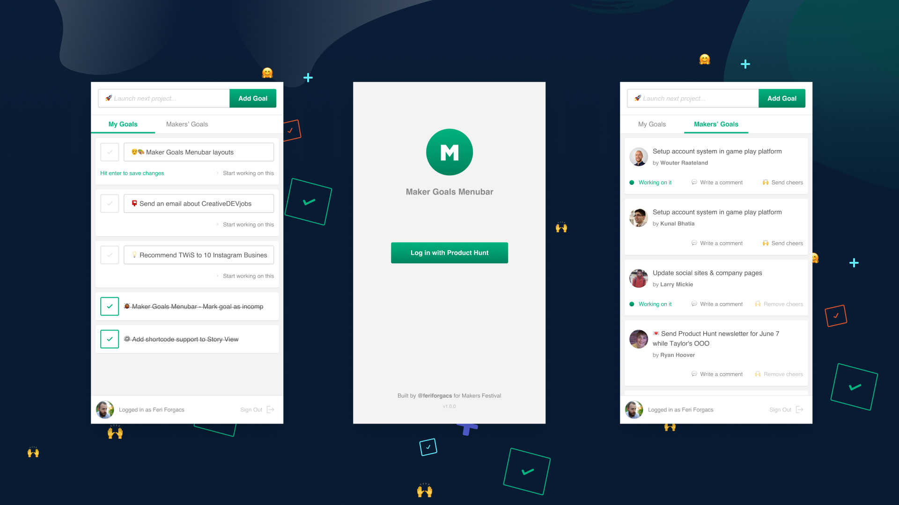

# About
Maker Goals Menubar was created to help you manage your goals on Product Hunt. It was built as part of the [Makers Festival - The 'API Edition'](https://www.producthunt.com/makers-festival/product-hunt-api-2-0) and became the winner of the Desktop category.
This was my first Node, React, GraphQL, Electron application so I'm pretty sure there are a lot of things to improve. Feel free to contribute 😊


# Features
- List and update your goals
- Create and complete goals
- View other makers' goals
- Send cheer to other makers

# Install
If you would like to give the application a try you can download the latest release from the following URLs:
- macOS: [download](https://bit.ly/makergoalsmenubar)
- Windows: [download](https://bit.ly/makergoalswin)
- Linux: [download](https://bit.ly/makergoalslinux)

# The structure of the app
Root folder: node server that handles the auth process and GraphQL requests.
Client folder: files of the react application.
Electron folder: files of the electron application.

# How does it work?
The live version of the application runs on Heroku, the electron app is just a wrapper that loads the Heroku URL. Why? This is how I was able to manage the authentication flow.

# Set up a development environment
First of all, you'll need to create a Product Hunt application to be able to use their API. Visit the following URL to add a new application: [Product Hunt Application Dashboard](https://api.producthunt.com/v2/oauth/applications). By default all apps are read-only. If you need write access, you should get in touch with the Product Hunt team at hello@producthunt.com. Read more about the possibilities in their [API docs](https://api.producthunt.com/v2/docs).
Clone this repository and make a copy of the .env.sample file, without the .sample ending. Add your API Key and API Secret to the newly created .env file and save it.
Open up your terminal and `cd` to the root folder of the repository. Install the necessary node modules by running `npm install`. Go to the client directory and run `npm install` there as well. Do the same in your electron folder.
Change the folder back to the root directory and run `npm run build` to build the frontend of the application.
Generate self-signed certificate to run app on https locally. `openssl req -x509 -sha256 -nodes -days 365 -newkey rsa:2048 -keyout server.key -out server.cert`
Start your server with the `npm start` command than visit https://localhost:3000
Now the app is running in your browser.
To test the electron application, first, edit the url in your `electron/main.js` file. On line 10, you'll see the URL you need for local testing. Save your modifications and go back to your terminal. Let the node server run and open up a new terminal window. Go to your electron folder and run the following command: `npm start`
If everything was fine, your electron app should start in a few seconds.

### The whole process with commands (after you created your PH Application and created your .env file):
```
git clone https://github.com/feriforgacs/producthunt-maker-goals-menubar.git
cd producthunt-maker-goals-menubar/ && npm install
cd client/ && npm install
cd .. && cd electron/ && npm install
cd .. && npm run build
openssl req -x509 -sha256 -nodes -days 365 -newkey rsa:2048 -keyout server.key -out server.cert
npm start
```

### To test the electron app
Keep your node server running, in a new terminal window:
```
cd electron/
npm start
```

# Run the app on a Heroku
To run the application on Heroku, follow these instructions: [Deploying Node.js Apps on Heroku](https://devcenter.heroku.com/articles/deploying-nodejs)
Don't forget to add your environment variables as [Config Vars](https://devcenter.heroku.com/articles/config-vars).
If your app is successfully running on Heroku, you can change back the URL in your `electron/main.js` file to the URL of your Heroku instance.

# Build the electron app
You can build your electron app by running `npm run dist` inside your electron folder. Learn more about electron builder [here](https://www.electron.build/).

# License
MIT License

# Contact
If you have any questions, feel free to get in touch. The easiest way is via Twitter [@feriforgacs](https://twitter.com/feriforgacs)

## TODO
- update auth flow to use the default browser instead of the electron window
- ability to load more goals
- ability to list completed goals